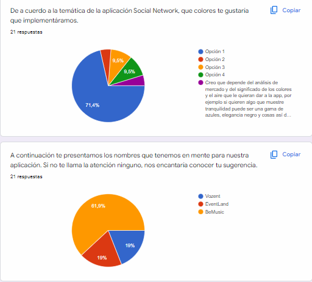
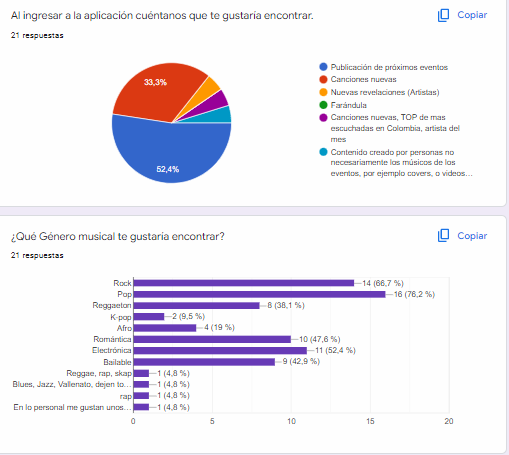
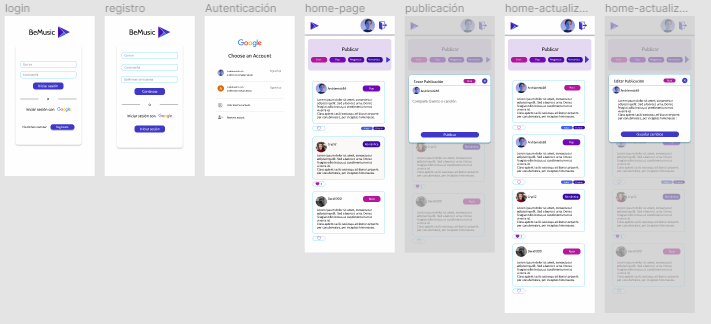
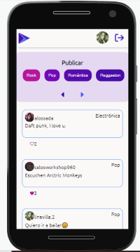
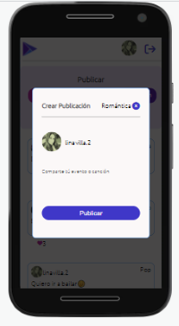
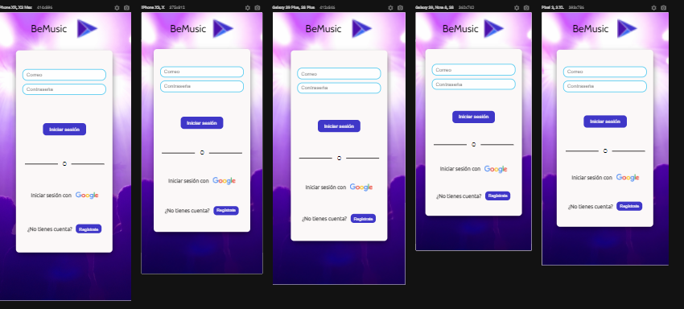
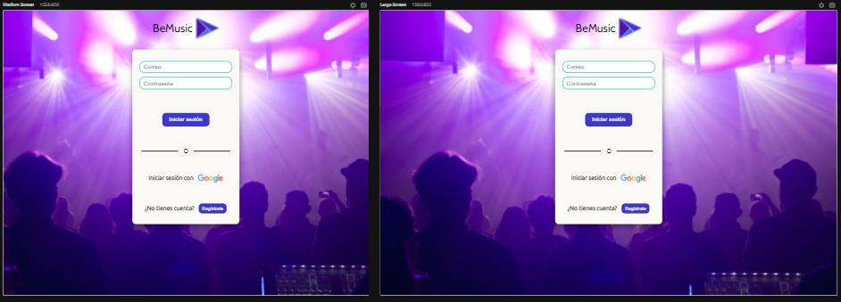

# Creando una Red Social

## Índice

* [1. Resumen del proyecto](#1-Resumen-del-proyecto)
* [2. Consideraciones generales](#2-Consideraciones-generales)
* [3. Prototipos de BeMusic](#3-Prototipos-de-BeMusic-de-alta-fidelidad)
* [4. Historias de Usuario](#4-Historias-de-usuario)
* [5. Responsive](#5-Responsive)

## 1. Resumen del proyecto
Nuestra Red social  tiene la temática de eventos musicales en Colombia y va dirigido a población de 16 años en adelante, quienes podrán crear una cuenta con su correo, o simplemente autenticarse con Gmail, allí podrán vizualizar, publicar ó eliminar  post, dar o quitar un like  y ver su conteo. Así mismo navegar en la App, dónde encontrarán los eventos de manera amigable y podrán compartir sobre sus intereses musicales.
Con ésta primera definición se le realizó a un grupo poblacional de 20 personas mayores de 16 años, una encuesta para entender que y como les gustaría que se viera una red social de este tipo . 

## 2. Consideraciones Generales

* Este proyecto se desarrollo por:
  
    - Ana Margarita García
    - Karen Yuliana Alarcón
    - Lina Marcela Villa

## 3. Prototipos de BeMusic de alta fidelidad
Finalmente usando los fundamentos del diseño visual, con ayuda de la herramienta [Figma](https://www.figma.com/) y teniendo en cuenta las 
observaciones presentadas por los usuarios, se realizó un prototipo de alta fidelidad con 7 pantallas.

## 4. Historias de Usuario
Con la ayuda de la herramienta Trello organizamos las Historias y el tiempo que definimos para el desarrollo del proyecto.
Fueron 5 Historias de Usuario basadas en el diseño del producto, las cuales se distribuyeron a lo largo de 5 Sprints.

En la definición de las historias de usuario tuvimos en cuenta la estructura inicial de: “Yo como usuario”, “Quiero”, “Para”. Y se definieron Los “Criterios de Aceptación” así como la “Definición de Terminado” para poder definir unas excelentes Historias de Usuario que nos permitieran llevar cada Historia a la culminación de la manera mas eficiente, entregando en cada Sprint una parte del producto funcional. 

## 5. Responsive
Cumpliendo los objetivos del proyecto nuestra Red social fue desarrollada para que se vea de manera eficiente en cualquier tipo de dispositivo como lo podemos ver en las siguientes imagenes.

